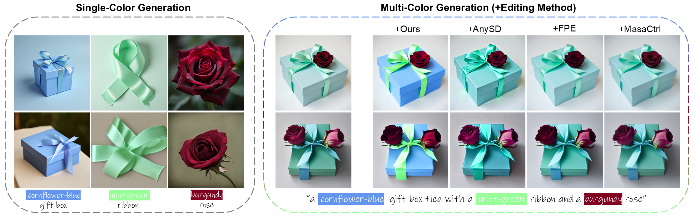

# Color Bind: Exploring Color Perception in Text-to-Image Models

This is the official pytorch implementation of Color-Edit.

[](https://arxiv.org/abs/2508.19791)


[[Project Website](https://tau-vailab.github.io/color-edit/)]

> **Color Bind: Exploring Color Perception in Text-to-Image Models**<br>
> Shay Shomer-Chai<sup>1</sup>, Wenxuan Peng <sup>2</sup>, Bharath Hariharan<sup>2</sup>, Hadar Averbuch-Elor<sup>2</sup><br>
> <sup>1</sup>Tel Aviv University, <sup>2</sup>Cornell University

>**Abstract** <br>
>                Text-to-image generation has recently seen remarkable success, 
                granting users with the ability to create high-quality images through 
                the use of text. However, contemporary methods face challenges in capturing 
                the precise semantics conveyed by complex multi-object prompts. Consequently, 
                many works have sought to mitigate such semantic misalignments, typically via 
                inference-time schemes that modify the attention layers of the denoising networks. 
                However, prior work has mostly utilized coarse metrics, such as the cosine similarity 
                between text and image CLIP embeddings, or human evaluations, which are challenging 
                to conduct on a larger-scale. In this work, we perform a case study on colors---
                a fundamental attribute commonly associated with objects in text prompts, which 
                offer a rich test bed for rigorous evaluation. Our analysis reveals that 
                pretrained models struggle to generate images that faithfully reflect multiple 
                color attributes—far more so than with single-color prompts—and that neither 
                inference-time techniques nor existing editing methods reliably resolve these 
                semantic misalignments.  Accordingly, we introduce a dedicated image editing 
                technique, mitigating the issue of multi-object semantic alignment for prompts 
                containing multiple colors. We demonstrate that our approach significantly 
                boosts performance over a wide range of metrics, considering images generated 
                by various text-to-image diffusion-based techniques.


</br>

# Getting Started

## Getting the repo
    git clone https://github.com/TAU-VAILab/color-edit.git
    cd color-edit

</br>

## Setting up conda environment for editing
    conda create --name color-edit python=3.11.4 --yes
    conda activate color-edit
    pip install -r requirements.txt

</br>

## Add relevant repos to enviroment src
    cd enviroment/src
    git clone https://github.com/orpatashnik/local-prompt-mixing.git
    git clone https://github.com/TencentARC/MasaCtrl.git

</br>

# General Usage

## Data Creation

Our method can run over real/generated images, we can generate across different model using the configs, you will need to create different config for each model, you can observe scripts/run_models_single_pair_benchmark_prompts_from_config.py for the naming convention of each supported model
    
    # ENV: Use the official env for each model
    # single color
    scripts/run_models_single_pair_benchmark_prompts_from_config.py --config configs/data_creation/sd_1_4_single_color1.json
    
    # two colors
    scripts/run_models_single_pair_benchmark_prompts_from_config.py --config configs/data_creation/sd_1_4_close.json

    # three colors
    scripts/run_models_three_colors_benchmark_prompts_from_config.py --config configs/data_creation/sd_1_4_close_distant_3_colors.json

*for flux model make sure to run huggingface-cli login --token <YOUR_TOKEN> before running the script.

Output will be as follow:</br>


## Create SAM masks and filtering
After data was created we want to create masks using SAM and we filter images without the object in the relevent prompt:

    # ENV: SAM env - use the official env    
    # single & pair colors
    python scripts/prepare_run_configs_for_editing_single_pair.py
    
    # three colors
    python scripts/prepare_run_configs_for_editing_three.py

You will need to edit the script for using the relevant out dirs from data creation step

Edit as follow:</br>

*for flux model use "flux_dev" as key and not "FLUX"

The output for the script is a json containing all images data and metadata including path to the generated SAM masks:</br>


In the editing process this json is the input under the "source_images_path_config".

## Editing

To run our system and perform textual edits on 2D images run:

    python coloredit_from_config.py --config configs/editing/stable_diffusion_2_1_config.json

stable_diffusion_2_1_config.json contains the configuration of our editing method, if you wish to change the data enter different "source_images_path_config" and "out_dir" as you please.
```json
{
    "run_name" : "close_sd_2_1",
    "scic_config" : {
                    "num_segments" : 8,
                    "background_segment_threshold" : 0.35,
                    "background_blend_timestep" : 35,
                    "background_blend_timestep_start" : 35,
                    "debug": true
                    },
    "editor_type_reconstruction" : "AttentionStore",
    "editor_type_target_prompt" : "SelfCrossAttentionControlColorEdit",
    "attention_loss_iters" : 10,
    "attention_loss_weight" : 20,
    "attnetion_loss_stoping_step" : 35,
    "attnetion_symmetric_kl_bottom_limit" : 0.1,
    "color_loss_weight" : 1.5,
    "color_loss_starting_step" : 25,
    "use_ref_intermediate_latents" : true,
    "model_name" : "sd_2_1",
    "use_SAM" : true,
    "adjust_single_token_colors": true,
    "source_images_path_config" : "images/sd_2_1/2_colors/close/sd_2_1_2_colors_prompts.json",
    "out_dir" : "outputs/repo/ColorEdit/prompts_our_color_with_ref_with_SAM_01al_1_5cl/sd_2_1/close/"
}

```
The output will be as follow:</br>
</br>
The "sample_*" dirs is for debugging of each prompt, the "*edited_output" is the clean output of the method.


</br>

## BibTeX
If you find our work useful in your research, please consider citing:

    @misc{chai2025colorbindexploringcolor,
        title={Color Bind: Exploring Color Perception in Text-to-Image Models}, 
        author={Shay Shomer Chai and Wenxuan Peng and Bharath Hariharan and Hadar Averbuch-Elor},
        year={2025},
        eprint={2508.19791},
        archivePrefix={arXiv},
        primaryClass={cs.CV},
        url={https://arxiv.org/abs/2508.19791}, 
    }
    
</br>

